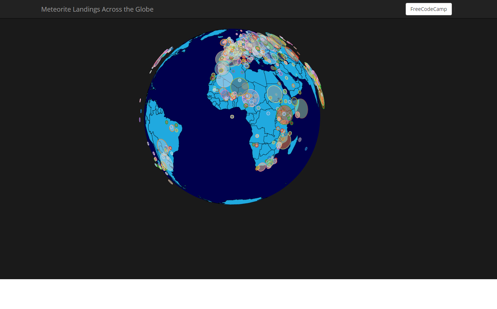
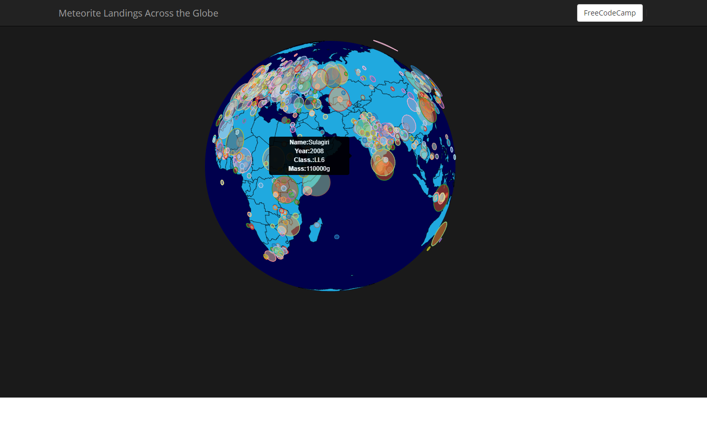

# Map Data Across the Globe

## Objective

Build an app that is functionally similar to this: https://codepen.io/FreeCodeCamp/full/mVEJag.

## Requirements

* User Story: I can see where all Meteorites landed on a world map.

* User Story: I can tell the relative size of the meteorite, just by looking at the way it's represented on the map.

* User Story: I can mouse over the meteorite's data point for additional data.

**Hint:** Here's a dataset you can use to build this: https://raw.githubusercontent.com/FreeCodeCamp/ProjectReferenceData/master/meteorite-strike-data.json

## Notes
globeData: 'https://unpkg.com/world-atlas@1.1.4/world/110m.json'

**Installation**
```
npm install
```

**Usage**
```
npm start
use http://localhost:3000/
```


